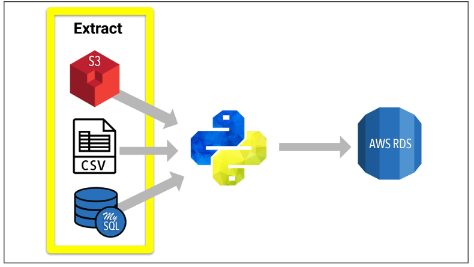

# DESCRIPTION
Using the Extract, Transform, Load (ETL) process to create data pipelines for a Wikipedia Movies JSON data.
A data pipepline transports data from Source to destination, and the ETL process creates the pipelines and transforms data in the process.

### SITUATION/TASK
Raw data exists in multiple places  and needs to be cleaned and structured for analysis. 
Develop an algorithm to predict which low budget movies being released would become popular so the world's largest 
online retailer can buy the streaming rights at a bargain. Your task is to predict the popular pictures/videos.

### APPROACH
Used the ETL Process. The data was filtered, parsed, translated, sorted, interpolated, pivoted, summarized, aggregated and merged.   First create a data set from two sources, a scrape from Wikipedia for all movies released from 1990 and 
rating data from the Movie Lens website. Secondly, Extract data from the two sources and Transform into one clean dataset. 
Finally, Load the dataset into a SQL database table.

 
 
      

### RESULTS
Creating a consistent structure in the data by transforming data into a nice clean data set for analysis and problem solving.

* Structured Data Loaded Into SQL Database

### THINGS LEARNED
* Create an ETL pipeline from raw data to a SQL database.
* Extract data from disparate sources using Python.
* Clean and transform data using Pandas.
* Use regular expressions to parse data and to transform text into numbers.
* Load data with PostgreSQL.

### SOFTWARE/
PostgreSQL, Pandas, Python, ETL Pipelines, Regular Expressions, Jupyter Notebook

### FIVE ASSUMPTIONS MADE
It's important to ensure that the following assumptions about the data are true: 

1) The function performs all transformation steps, with no errors.   
2) Data is sorted uniquely and in the same way in all input datasets.
   If this is not the case then the merge will be unable to match in some columns.
3) That the data is merged using a unique identifier such as "imdb_id" to avoid having duplicated rows in data. 
4) Some columns will have null values as a result of missing data.
5) The function performs all load steps with no errors, while existing data is removed while the load step reloads the data in SQL.
